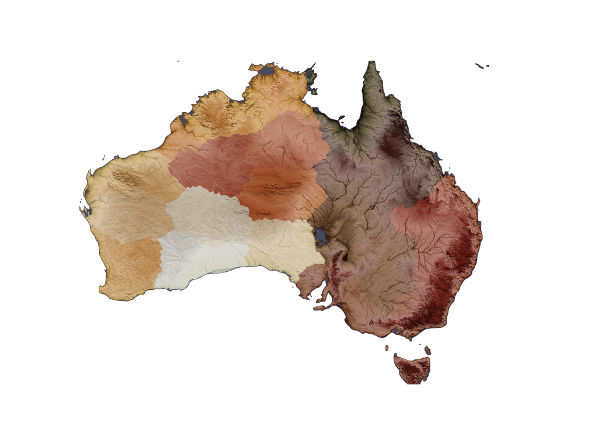
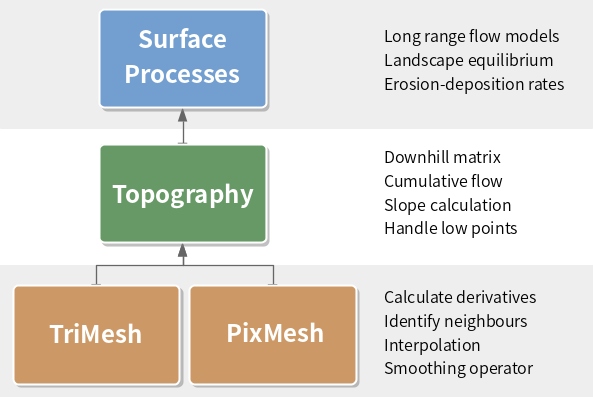

---
jupyter:
  jupytext:
    formats: ipynb,md
    text_representation:
      extension: .md
      format_name: markdown
      format_version: '1.2'
      jupytext_version: 1.4.2
  kernelspec:
    display_name: Python 3
    language: python
    name: python3
---

<!-- #region -->
# Quagmire



Quagmire is a Python surface process framework for building erosion and deposition models on highly parallel, decomposed structured and unstructured meshes. Quagmire is suitable for models that focus on very large tectonic length and timescales and consider the generic, coupled surface / tectonics problem. This problem poses interesting challenges in algorithms for parallel computation in models where there is likely to be significant lateral deformation and catchment changes. Quagmire algorithms are specifically developed to manage this problem efficiently.

Quagmire is structured into three major classes that inherit methods and attributes from lower tiers.



The Surface Processes class inherits from the Topography class, which in turn inherits from TriMesh or PixMesh depending on the type of mesh.

## Demonstration

Running on [mybinder.org](https://mybinder.org/v2/gh/underworldcode/quagmire-live-documentation.git/master)

[](https://mybinder.org/v2/gh/underworldcode/quagmire-live-documentation.git/master)


Quagmire workflow examples and tutorials on the Underworld cloud

[](https://demon.underworldcloud.org/hub/user-redirect/git-pull?repo=https%3A%2F%2Fgithub.com%2Funderworld-community%2Fquagmire-examples-and-workflows&urlpath=lab%2Ftree%2Fquagmire-examples-and-workflows%2FREADME.ipynb)


### Notebooks

Tutorial notebooks (getting started)
 
  - [Meshing / Stripy](Notebooks/Tutorial/Ex1-Creating-Meshes.ipynb)             
  - [Topography Meshes](Notebooks/Tutorial/Ex2-Topography-Meshes.ipynb)          
  - [Surface Process Meshes](Notebooks/Tutorial/Ex3-Surface-Process-Meshes.ipynb)     
  - [Downhill Pathways](Notebooks/Tutorial/Ex4-Multiple-downhill-pathways.ipynb)
  - [Pit filling, lakes, swamps etc](Notebooks/Tutorial/Ex5-PreprocessingSurfaces.ipynb)
  - [Catchments](Notebooks/Tutorial/Ex6-Catchment-Analysis.ipynb)
  
Idealised Examples (mathematical landscapes for testing the methods):

  - [Crenellated Sombrero (aka Octopants)](Notebooks/IdealisedExamples/TriMeshOctoPants.ipynb)
  - [Crenellated Sombrero (regular mesh)](Notebooks/IdealisedExamples/PixMeshOctoPants.ipynb)

Worked Examples:

  NOT running on binder as additional dependencies for mapping are required

  - [Using ETOPO1](Notebooks/WorkedExamples/WEx1-ETOPO1-workflow.ipynb)
  - [Map of Tasmania - ETOPO1](Notebooks/WorkedExamples/WEx2-ETOPO1-Tasmania.ipynb)


## Parallel Usage

Quagmire is highly scalable. All of the python scripts in the *tests* subdirectory can be run in parallel, e.g.

```bash
mpirun -np 4 python stream_power.py
```

where the number after the `-np` flag specifies the number of processors. To do this, you need a local installation which we recommend you do using `docker`  

```bash
docker pull underworldcode/quagmire:0.3
```

```bash
docker run -v ${PWD}:/home/jovyan -P underworldcode/quagmire:0.3
```


<!-- #endregion -->

```python

```
